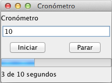

# Ejercicios programación multihilo

1. Haz un programa que dentro de un hilo muestre: nombre del hilo, su prioridad, su id y los hilos activos.
2. 
2. Realiza una aplicación de consola que cuente hasta un número determinado (mostrando la secuencia por pantalla) utilizando dos hilos, de forma que cada uno de ellos cuente un rango de números

3. Realiza una aplicación que simule una carrera de coches (de hasta 4 coches). Para cada coche se podrá configurar su velocidad y en la aplicación podremos configurar la distancia del circuito. Una vez lanzada la carrera se irá mostrando por pantalla (mediante barras de progreso, por ejemplo) el desarrollo de la misma (el avance de cada coche en el tiempo). Al final de la carrera se anunciará el coche ganador y los demás se detendrán mostrando cuánta distancia han recorrido [S. Faci]  
  
4. Realiza una aplicación en la que el usuario pueda programar una cuenta atrás que al terminar muestre un mensaje en la pantalla principal. Además, se mostrará en una barra de progreso el transcurso de dicha cuenta atrás (vaciando la barra de progreso) [S. Faci]

5. Realiza una aplicación en la que se muestre, mediante una barra de progreso y una etiqueta de texto, el tiempo que pasa, en segundos, hasta una cantidad que habrá introducido el usuario. En cualquier momento éste podrá cancelar la cuenta.

6. Realiza una aplicación que descargue un fichero de Internet mostrando, al final, la duración de la descarga formato MM:SS

