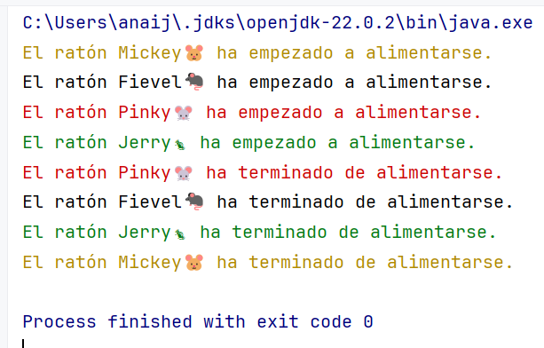

## Ejercicio: Roedores comiendo.

### Objetivo
Desarrollar un programa multihilo, en que cada hilo represente un roedor que tarda un cierto tiempo en comer.

El resultado será parecido a este, donde se crean cuatro hilos, uno para cada roedor:
- "Fievel", es una rata que tarda 4 segundos en alimentarse.
- "Jerry" es una ardilla rayada que tarda 5 segundos en alimentarse.
- "Pinky" es un ratón que tarda 3 segundos en alimentarse.
- "Mickey" es un hamster que tarda 6 segundos en alimentarse.

El resultado que se espera es parecido a este: 

### Descripción
Crea una clase llamada `Roedor` que tenga los siguientes atributos y métodos:

1. **Atributos**:
   - `nombre` (String): El nombre del ratón.
   - `tiempoEnComer` (int): El tiempo en segundos que tarda en comer.
   - `color` (Color): El color del ratón. (Utiliza el enumerado `Color` del paquete `utilidades`)
   - `emoji` (Emoji): El emoji que representa al ratón. (Utiliza el enumerado `Emoji` del paquete `utilidades`)

2. **Constructor**:
   - Un constructor que inicialice los atributos `nombre`, `tiempoEnComer`, `color` y `emoji` con los valores proporcionados como parámetros.

3. **Métodos**:
   - `public void comer()`: Este método consiste en lo siguiente: 
     1. Primero imprime un mensaje en que se muestre color, nombre y emoji del roedor indicando que el ratón empieza a alimentarse. 
   
     2. Después se detiene el tiempo esperando que el roedor termine de comer. 
   
      3. Imprime otro mensaje parecido al primero en el que se indica que el roedor ha terminado de comer. 
   - `public void run()`: llama al método `comer()`.

### Requisitos
- Para hacer este ejercicio necesitas añadir a tu rama el paquete `utilidades` y sus ficheros, que están en la rama `master` del repositorio remoto.
- La clase debe estar en el paquete `ejercicios.ejercicio2`.
- Utiliza el manejo adecuado de excepciones para `InterruptedException` en el método `comer`.

### Entrega
Nombra el archivo `Roedor<tu-nombre>.java` a tu rama en el repositorio de GitHub en la carpeta `src/ejercicios/ejercicio2`.

