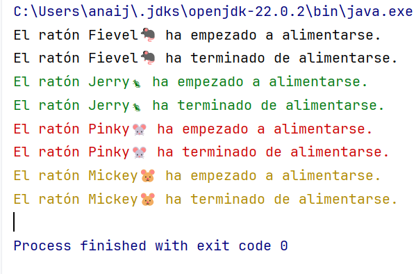

# Roedores que esperan a que otros terminen

Hemos domesticado a los roedores para que esperen su turno para comer, de forma que cuando uno de ellos empieza a comer, todos los demas esperan a que les llegue el turno. 
Modifica el código del ejercicio anterior para que el resultado sea parecido a este: 

