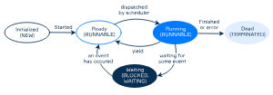

# Estados de un hilo
A lo largo de su ciclo de vida, el estado de un hilo (thread) cambia. Esto ocurre tanto por las acciones del programador como por eventos internos del sistema operativo. En esta lección, consideraremos los posibles estados de un hilo y algunas características a nivel del sistema operativo (SO).

# El enumerado Thread.State
En Java, el estado de un hilo se representa mediante el enumerado `Thread.State`, que tiene seis posibles valores:

- **NEW**: se ha creado una instancia de la clase `Thread`, pero aún no se ha iniciado.  
- **RUNNABLE**: un hilo está ejecutándose en la JVM, pero puede estar esperando recursos del sistema operativo, como el procesador. Diríamos que está listo para ser ejecutado. 
- **BLOCKED**: un hilo está bloqueado esperando un candado de monitor (`lock`, lo veremos más adelante).  
- **WAITING**: un hilo está esperando indefinidamente a que otro hilo realice una tarea (por ejemplo, cuando se usa join sin un tiempo límite).
- **TIMED_WAITING**: un hilo está esperando a otro hilo durante un tiempo determinado (por ejemplo, cuando se usa `sleep` o `join` con un tiempo límite).
- **TERMINATED:** un hilo se termina cuando el método run se ejecuta completamente o se produce una excepción no controlada. Una vez que un hilo termina, nunca vuelve al estado `RUNNABLE`.
Para obtener el estado actual de un hilo, se puede usar el método de instancia `getState()`.

Veamos cómo cambian estos estados según las acciones del programador:

````java
Thread worker = ... // nuevo hilo para realizar una tarea compleja  
System.out.println(worker.getState()); // NEW

worker.start(); // iniciar el hilo  
System.out.println(worker.getState()); // RUNNABLE

worker.join(); // esperar a que el hilo termine  
System.out.println(worker.getState()); // TERMINATED  
````
Cuando un hilo se crea, su estado es `NEW`. Al iniciar el hilo, su estado cambia a `RUNNABLE` (aunque el método run puede no haberse ejecutado todavía). Finalmente, cuando el hilo termina, su estado pasa a `TERMINATED`. Al mismo tiempo, el hilo principal pasa al estado `WAITING` (indefinidamente) después de invocar el método `join()` sobre el hilo.

## El (casi) ciclo de vida real de un hilo
Los estados mencionados anteriormente son específicos desde el punto de vista de Java. Sin embargo, el ciclo de vida real de un hilo es ligeramente diferente. Por ejemplo, el estado `RUNNABLE` es más complejo de lo que parece. En este estado, un hilo podría estar ejecutándose realmente o podría estar listo para ejecutarse.

A continuación, se muestra el ciclo de vida simplificado de un hilo relacionado con la terminología del sistema operativo. El diagrama incluye cinco estados y los eventos que hacen que el hilo pase de un estado a otro. Es importante no confundir estos estados con los correspondientes en Java (que se representan en MAYÚSCULAS).

## Ciclo de vida simplificado de un hilo en el sistema operativo
Después de la inicialización, el hilo está listo para ejecutarse (`Ready`).
Es responsabilidad del planificador de hilos asignar instantes de tiempo para que un hilo se ejecute (`Running`) y luego moverlo de nuevo al estado `Ready`. Esto se utiliza para compartir el tiempo del procesador entre múltiples hilos de forma concurrente. De lo contrario, un solo hilo podría capturar todo el tiempo del procesador disponible.
El estado `Waiting` significa que un hilo está temporalmente inactivo (por ejemplo, puede estar esperando a otro hilo o completando una operación de entrada/salida). Un hilo en este estado no puede continuar su ejecución hasta que se mueva al estado `Ready`.
En realidad, este estado `Waiting` corresponde a un conjunto de diferentes estados que se explorarán más adelante.
Por supuesto, el ciclo de vida real de los hilos es aún más complicado de lo que hemos discutido. Por ejemplo, el estado `Waiting` en realidad engloba múltiples estados al mismo tiempo. Por ahora, basta con tener una visión simplificada de cómo funcionan los hilos.

R