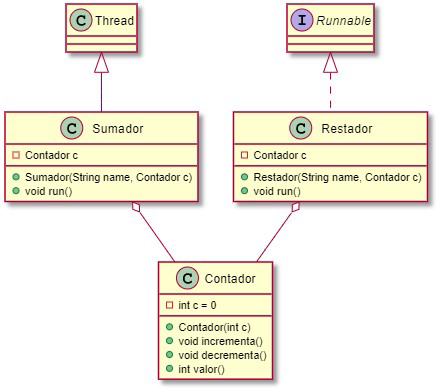

# Sincronización y comunicación de hilos

## 1. Memoria compartida
A menudo los hilos necesitan comunicarse unos con otros. La forma que tienen de hacerlo consiste en compartir un objeto.  

Vamos a desarrollar un ejemplo en el que dos hilos comparten un objeto de la clase `Contador`.

>**Nota**: este diagrama está hecho con PlantUml. Para ver cómo interpretar los símbolos, entra en https://plantuml.com/es/class-diagram 
- Para probar el objeto compartido, en una cuarta clase que contiene el main se crea un objeto `Contador` que se inicializa a 100 y se crean y lanzan dos `threads`, uno de tipo `Sumador` y otro de tipo `Restador`.  

- En la clase `Sumador` se usa el método del objeto `Contador` que incrementa en uno su valor mientras que en la clase `Restador` se usa el método que decrementa en uno su valor.  

- Cada una va a realizar la acción 300 veces, esperando entre cada acción un tiempo aleatorio entre 50ms y 150ms. Para ello utiliza `ThreadLocalRandom` (investiga cómo utilizarlo). Es muy importante asegurarse que pasamos el mismo objeto `Contador` como parámetro al constructor de `Sumador` y de `Restador`, para
que ambos trabajen con la misma instancia.

>**Comportamiento esperado**
>Crea las cuatro clases en función del diagrama de clases proporcionado. Asegúrate de que `Sumador` hereda de `Thread` y `Restador` implementa la interfaz `Runnable` para comprobar las diferencias de uso y creación de threads a partir de cada
tipo de clase.    
> 
> ¿Qué debería ocurrir tras ejecutar el código?  
> Comprueba lo que pasa realmente. Intenta ejecutar el programa varias veces para ver si puedes obtener resultados diferentes.

Si analizamos el problema anterior, veremos que se está intentando ejecutar el siguiente código en paralelo desde diferentes
hilos, en la misma instancia (memoria compartida):
````java
public void incrementa() { c++; }
public void decrementa() { c--; }
````
Se ve claramente que este código no puede ser ejecutado sin tener problemas de concurrencia.
Entonces, para evitar que varios hilos ejecuten esos métodos de forma concurrente necesitamos estructuras de programación que nos ayuden a conseguirlo.


## Vocabulario
- **Condición de carrera**: Situación en que el correcto funcionamiento de un programa depende del orden en que se intercale la ejecución de las instrucciones de sus diferente hilos. Esto ocurre cuando uno o más hilos acceden a
  información compartida de forma concurrente e intentan modificarla a la vez.

- **Deadlock:** Situación en que dos o más hilos están bloqueados mutuamente, todos ellos esperando para conseguir el bloqueo sobre objetos bloqueados por otros hilos, de manera que ninguno de ellos podrá continuar nunca.

- **Sección crítica:** Fragmento de un programa que no puede ejecutar de manera simultánea (concurrentemente) más de un hilo del programa, es decir, que distintos hilos deben ejecutar en exclusión mutua.

- **Thread-safe:** Se dice de una clase cuyos métodos implementan los mecanismos de sincronización necesarios para el uso concurrente de sus objetos por parte de distintos hilos, de manera que no es necesario ningún mecanismo de
  sincronización externo a la propia clase.