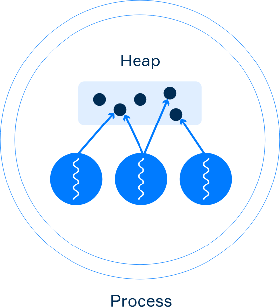

# Compartir datos entre hilos
Los hilos que pertenecen al mismo proceso comparten la memoria común (denominada `Heap`) pueden comunicarse utilizando datos compartidos en esta memoria. Para poder acceder a los mismos datos desde varios hilos, cada hilo debe tener una referencia a estos datos (**a través de un objeto**). 


Varios hilos de un único proceso tienen referencias a objetos en el `Heap`.

Veamos un ejemplo. Aquí tenemos una clase llamada `Counter`.

````java
class Counter {

    private int value = 0;

    public void increment() {
        value++;
    }

    public int getValue() {
        return value;
    }
}
````
La clase tiene dos métodos: `increment` y `getValue`. Cada invocación de `increment` suma 1 al atributo `value`, y al llamar a `getValue` se devuelve el valor actual del atributo.

Y aquí hay una clase que extiende `Thread`:
````java
class MyThread extends Thread {

    private final Counter counter;

    public MyThread(Counter counter) {
        this.counter = counter;
    }

    @Override
    public void run() {
        counter.increment();
    }
}
````

El constructor de `MyThread` recibe una instancia de `Counter` y la almacena en el atributo. El método `run` invoca el método `increment` del objeto `counter`.

Ahora creamos una instancia de `Counter` y dos instancias de `MyThread`. Ambas instancias de `MyThread` tienen la misma referencia al objeto `counter`.
````java
Counter counter = new Counter();

MyThread thread1 = new MyThread(counter);
MyThread thread2 = new MyThread(counter);
````
Ahora veamos qué sucede cuando iniciamos ambos hilos uno por uno y mostramos el resultado de `counter.getValue()`.
````java
thread1.start(); // start the first thread
thread1.join();  // wait for the first thread

thread2.start(); // start the second thread
thread2.join();  // wait for the second thread

System.out.println(counter.getValue()); // it prints 2
````
Como puedes ver si lo pruebas tú mismo, el resultado es 2, porque ambos hilos trabajan con los mismos datos utilizando una referencia.

En este ejemplo, iniciamos el primer hilo y esperamos hasta que haya completado su trabajo (para ese momento se realizó un incremento), luego iniciamos el segundo hilo y esperamos hasta que también haya completado su trabajo (se realizó otro incremento). El resultado es exactamente el que esperábamos.

Cuando escribes tu código en diferentes hilos que trabajan con los mismos datos de manera concurrente, es importante entender algunas cosas:

- algunas operaciones no son atómicas;  

- los cambios de una variable realizados por un hilo pueden no ser visibles para los otros hilos;  

- si los cambios son visibles, su orden podría no serlo.  

Ahora vamos a aprender más sobre estos conceptos.

## Interferencia entre hilos
Una **operación no atómica** es una operación que consta de varios pasos. Un hilo puede operar sobre un valor intermedio de una operación no atómica realizada por otro hilo. Esto lleva a un problema llamado **interferencia entre hilos: las secuencias de pasos de operaciones no atómicas realizadas por varios hilos pueden solaparse**.

Comencemos explicando por qué el incremento es una operación no atómica y cómo funciona exactamente. Como ejemplo, consideremos nuevamente la clase `Counter`.
````java
class Counter {

    private int value = 0;

    public void increment() {
        value++; // the same thing as value = value + 1   
    }

    public int getValue() {
        return value;
    }
}
````
>**Nota:** en el ejemplo anterior, los dos hilos no trabajaron con los datos al mismo tiempo. Antes de que el segundo hilo comenzara, el primero ya había terminado.

La operación `value++` se puede descomponer en tres pasos:

1. leer el valor actual;
2. incrementar el valor en 1;
3. escribir el valor incrementado nuevamente en el atributo;  

Dado que la operación de incremento no es atómica y toma 3 pasos para ejecutarse, puede ocurrir **interferencia entre hilos** si dos hilos llaman al método `increment` de la misma instancia de `Counter`.

De la misma manera, la operación `value--` puede descomponerse en tres pasos.

Supongamos que tenemos una instancia de la clase `Counter`:

````java
Counter counter = new Counter();
````
El valor inicial del atributo es 0.

Ahora, si el `hilo A` invoca el método `increment` de esta instancia y el `hilo B` también invoca el método al mismo tiempo, lo siguiente ocurre:

1. **Hilo A:** lee el valor de la variable.
2. **Hilo A:** incrementa el valor leído en 1.
3. **Hilo B:** lee el valor de la variable (lee un valor intermedio de 0).
4. **Hilo A:** escribe el resultado en la variable (ahora, el valor actual del atributo es 1).
5. **Hilo B:** incrementa el valor leído en 1.
6. **Hilo B:** escribe el resultado en la variable (ahora, el valor actual del atributo es 1).  

En este caso, después de que dos hilos llamen al método `increment`, podemos obtener el resultado inesperado (1 en lugar de 2). Esto significa que el resultado del hilo A se perdió, siendo sobrescrito por el hilo B. Aunque a veces el resultado puede ser correcto, esta intercalación en particular es posible.

Acabamos de ver cómo las operaciones de incremento y decremento no son atómicas. En este tema, no discutiremos cómo se puede resolver este problema, solo tenlo en cuenta por ahora.

Consideremos otro caso: una asignación de valores de 64 bits. Puede ser sorprendente, pero incluso la lectura y escritura de atributos de tipos double y long (64 bits) pueden no ser atómicas en algunas plataformas.
````java
class MyClass {

    long longVal; // reading and writing may be not atomic

    double doubleVal; // reading and writing may be not atomic
}
````
Esto significa que, mientras un hilo escribe un valor en una variable, otro hilo puede acceder a un resultado intermedio (por ejemplo, solo 32 bits escritos). Para hacer que estas operaciones sean atómicas, los atributos deben declararse utilizando la palabra clave `volatile`.
````java
class MyClass {

    volatile long longVal; // reading and writing are atomic now

    volatile double doubleVal; // reading and writing are atomic now
}
````
La lectura y escritura en los atributos de otros tipos primitivos (`boolean`, `byte`, `short`, `int`, `char`, `float`) están garantizadas como atómicas.

En aplicaciones grandes, los errores de interferencia entre hilos pueden ser difíciles de detectar.

## Visibilidad entre hilos
A veces, cuando un hilo cambia datos compartidos, otro hilo puede no notar estos cambios o puede obtenerlos en un orden diferente. Esto significa que diferentes hilos pueden tener vistas inconsistentes de los mismos datos.

Las razones son diversas, incluyendo el almacenamiento en caché de valores para los hilos, optimización del compilador, y más.   

Afortunadamente, la mayoría de los programadores no necesitan un entendimiento detallado de las causas. Lo que se necesita es una estrategia para evitarlas.

**Ejemplo**
Aquí tenemos un atributo de tipo `int`, declarado e inicializado:

````java
int number = 0;
````
El atributo es compartido entre dos hilos: Hilo A y Hilo B.

Hilo A incrementa el número en 5:

````java
number += 5;
````
Justo después de esto, Hilo B imprime el número en la salida estándar:

````java
System.out.println(number);
````
La salida puede ser 0 o 5, porque no hay garantía de que el cambio realizado por Hilo A sea visible para Hilo B.

Como ya mencionamos, la palabra clave `volatile` se usa para la visibilidad. Para hacer que los cambios de un valor realizados por un hilo sean visibles para otros hilos, debemos declarar el atributo con la palabra clave `volatile`.

````java
volatile int number = 0;
````
Cuando el atributo se declara como `volatile`, se garantiza que todos los cambios realizados en este atributo por un hilo son visibles para otro hilo cuando este lea el valor de este atributo.

La palabra clave `volatile` se puede escribir en la declaración de atributos de instancia y estáticos.

## Otros casos de visibilidad
A veces no necesitamos escribir la palabra clave `volatile`. Los siguientes procedimientos también garantizan visibilidad:

- Los cambios de variables realizados por un hilo antes de iniciar un nuevo hilo siempre son visibles para el nuevo hilo.
- Los cambios de variables dentro de un hilo siempre son visibles para cualquier otro hilo después de que el hilo haya regresado exitosamente de un join en el hilo (esto lo usamos al principio de este tema).
No vamos a considerar todas las formas existentes de garantizar la visibilidad ahora. Estas se formalizan mediante una relación especial llamada *"Happens-before"*. Por ahora, recuerda el uso de `volatile` y los dos casos mencionados.

## Más sobre la palabra clave volatile
La palabra clave volatile nos permite hacer visibles los cambios de un atributo realizados por un hilo a otros hilos. Esta palabra clave también hace que la escritura en atributos de tipo `double` y `long` sea atómica. Sin embargo, la palabra clave no hace atómicas las operaciones de incremento/decremento y similares.
